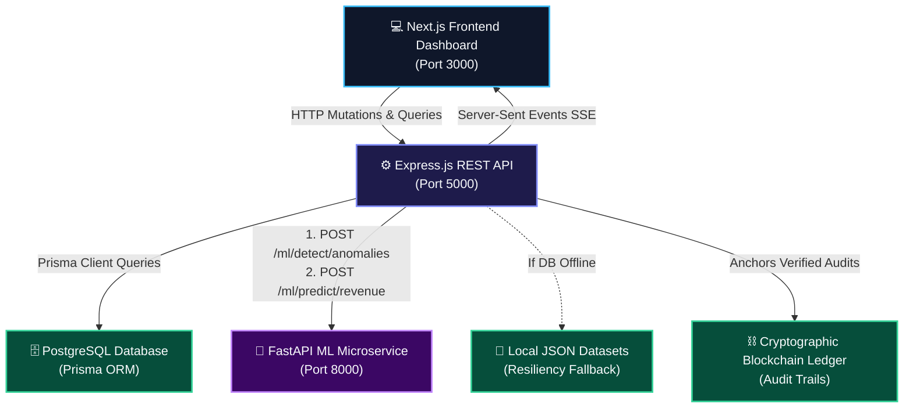

# FranchiseOpsAI — High-Resilience AI Franchise Management Portal

FranchiseOpsAI is a full-stack, enterprise-grade franchise operations and management portal. The system coordinates multi-location outlet monitoring, automated inventory tracking, staff audits, campaign ROI analytics, real-time transaction anomalies, and predictive machine learning models in a unified, high-resilience architecture.

---

## 🏗️ System Architecture

The project is structured as a decoupled, multi-service microservice repository designed for high availability, sub-second telemetry updates, and resilient offline fallbacks.

### 🌐 System Topology



---

### 🔄 Data Pipeline & Transaction Sequence

The sequence diagram below maps how POS transactions, compliance audits, and ML predictions flow through the systems and broadcast to dashboards in real-time.

```mermaid
sequenceDiagram
    autonumber
    actor Mgr as Store Manager
    participant UI as Next.js Dashboard
    participant API as Express Server
    participant DB as PostgreSQL
    participant ML as FastAPI ML Service
    participant SSE as SSE Broadcast Hub

    Mgr->>UI: Submit POS Sale / Audit Checklist
    UI->>API: POST /api/sales or POST /api/compliance
    
    rect rgb(30, 41, 59)
        note right of API: Validation & Processing
        API->>API: Run Zod Schema Validation
        API->>DB: Write Record (Sales / Compliance Logs)
    end

    alt Low Stock Triggered
        API->>DB: Write Alert Notification
        API->>SSE: Emit STOCK_LOW Warning
    end

    rect rgb(58, 20, 96)
        note right of API: Async ML Inference
        API->>ML: POST /ml/detect/anomalies (Volume Spikes/Drops)
        ML-->>API: Return Anomaly Flag & Confidences
    end

    alt Anomaly Detected
        API->>DB: Write Anomaly Log
        API->>SSE: Emit TRANSACTION_ANOMALY Broadcast
    end

    API-->>UI: Return Success Response (200 OK)
    SSE-->>UI: Push Real-Time SSE Update Message
    UI->>UI: Dynamic Redraw / Refetch State
```



---

### 📂 Directory & Component Structure

```
FranchiseManagementSystem/
├── docker-compose.yml           # Unified multi-container orchestration config
├── backend/                     # Node.js Express API orchestrator
│   ├── Dockerfile
│   ├── prisma/                  # Database schemas (PostgreSQL client configurations)
│   └── src/                     # Route endpoints, simulation loops, & services
├── frontend/                    # Next.js React user interface dashboard
│   ├── Dockerfile
│   ├── app/                     # Next.js routing and entry layers
│   └── components/              # React dashboard view layers (OutletMonitoring.tsx)
└── ml_service/                  # Python FastAPI machine learning server
    ├── Dockerfile
    ├── main.py                  # API endpoints for predictions and anomalies
    └── models/                  # Programmatic training loops and predictors
```

---

## 📦 Database Schema (Prisma DB Layer)

The database schema is mapped via Prisma ORM connecting to **PostgreSQL**. The core database models are:

* **`outlets`:** Mapped locations, status (Healthy/Watch/Critical), addresses, coordinates (lat/long), and manager associations.
* **`users` / `managers`:** Secure credentials, roles (admin/manager), and manager work statistics.
* **`sales`:** Tracks historical daily revenue logs, orders, and customer counts across outlets.
* **`inventory_items`:** Tracks raw material SKUs, stock levels, reorder thresholds, and suppliers.
* **`monthly_targets` / `performance`:** Financial budgets, actual revenues, targets, and percentage achievements.
* **`outlet_health` / `outlet_ratings`:** Aggregated performance dimensions (sales, inventory, audits) and direct customer NPS reviews.
* **`expenses`:** Tracks store operating costs (rent, utilities, raw materials).
* **`notifications`:** Local notifications ledger for system-wide flags.

---

## 🛠️ Main Codebase Modules

### 1. Authentication & Session Control (`/backend/src/routes/authRoutes.js`)
* Manages secure user session creation, passwords encryption hashes, and JWT tokens.
* Enforces role-based permissions (admin/manager scope controls) across the API routers.

### 2. Outlet Directory & Map HUD (`/backend/src/routes/outletRoutes.js`)
* Serves complete geographic mappings of all franchise stores.
* Calculates actual revenue achievements relative to target metrics to status stores.

### 3. Inventory Control & Reorder Registry (`/backend/src/routes/inventoryRoutes.js`)
* Houses raw materials listings (e.g. coffee beans, cups, milk).
* Flags low quantities relative to safety thresholds and coordinates supplier reorder pipelines.

### 4. Staff Management & Directories (`/backend/src/routes/employeeRoutes.js`)
* Stores attendance logs, schedules, and shift planning parameters.
* Feeds daily clock-in compliance indices (present, late, absent) directly into the outlet health scores.

### 5. Audit Compliance Checklist (`/backend/src/routes/complianceRoutes.js`)
* Daily checklists tracking food safety temperatures, cleaning protocols, and register balances.
* Completed sheets compute overall store compliance percentages.

### 6. Server-Sent Events (SSE) Broadcast Hub (`/backend/src/routes/sseRoutes.js`)
* Exposes an active HTTP streaming channel linking Next.js clients directly to the backend.
* Automatically broadcasts register events, alerts, and model updates in real-time.

### 7. POS Register simulator (`/backend/src/services/posSimulator.js`)
* Triggers mock transaction register sales every 3 to 30 seconds.
* Deducts matching stock quantities, logs revenue, and queries FastAPI to scan for transaction anomalies.

### 8. FastAPI Python Machine Learning Service (`/ml_service`)
* **XGBoost (Revenue):** Predicts revenue trajectories based on lag parameters, discounts, and spends.
* **Random Forest (Classification):** Categorizes stores into demand levels.
* **Ridge Regression (Reorders):** Calculates optimized stock orders.
* **Isolation Forest (Anomalies):** Evaluates POS transaction streams to flag outlier volume drops/spikes.
* **Retraining Pipeline (`trainer.py`):** Re-fits models asynchronously on command.

### 9. Interactive Settings page (`/frontend/components/OutletMonitoring.tsx`)
* **Theme Customizer:** Accent color highlights chooser (Teal, Purple, Amber, Electric Blue, Rose), glow levels, and blur depth variables.
* **ML Tuner:** Direct adjustments for learning rates, RF trees count, and Ridge alpha weights.
* **AI Copilot Selector:** Toggle personalities (Strategic Coach, Sarcastic Consultant) and enter Gemini API keys.
* **Resilience Switch:** Manually toggle mock database outages to verify the system falls back onto local JSON datasets.
* **Terminal Feed:** Visual logs tracking system activity.

---

## 💾 Resiliency & Offline Fallbacks

* **Database Fallback:** If PostgreSQL goes offline, the Express backend captures the Prisma error and loads static JSON datasets (e.g. `outlets.json`, `inventory.json`) and generates average transaction logs, keeping the microservices and UI fully functional.
* **ML Fallback:** If the FastAPI Python microservice is offline, the Next.js frontend hides predictive panels, and the backend handles prediction timeouts (2-second limits) safely.

---

## 🚀 Docker Setup

Run the multi-service stack with a single command:

```bash
docker-compose up --build
```
This builds and exposes:
* **Next.js Web Client:** `http://localhost:3000`
* **Express Orchestrator API:** `http://localhost:5000`
* **FastAPI ML Service:** `http://localhost:8000`
* **PostgreSQL:** `localhost:5432`
