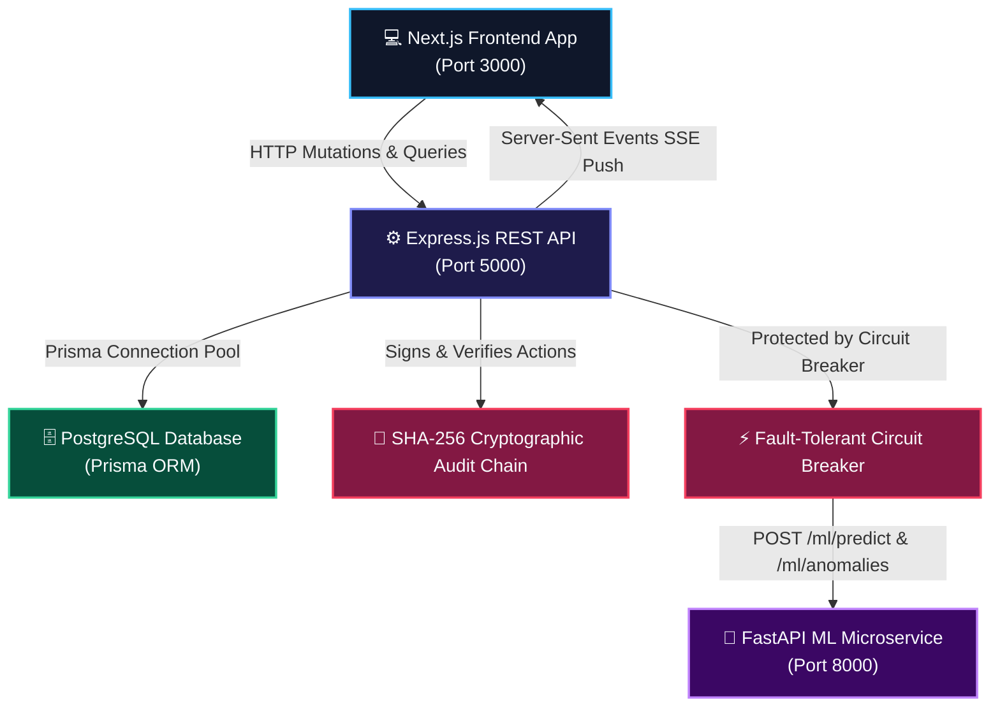

# 🏢 FranchiseOpsAI — Enterprise Franchise Intelligence & Operations Network

[](https://github.com/Chandana-Projects/FranchiseManagementSystem/actions/workflows/security-audit.yml)
[](https://nodejs.org/)
[](https://nextjs.org/)
[](https://fastapi.tiangolo.com/)
[](https://www.prisma.io/)
[](https://owasp.org/)
[](#-automated-testing--ci-guardrails)

**FranchiseOpsAI (OmniFranchise)** is a production-grade, multi-tenant AI operations platform designed for franchise networks. It unifies real-time outlet telemetry, automated inventory reordering, workforce attendance audits, marketing campaign ROAS, POS fraud anomaly detection, and predictive Machine Learning into an executive glassmorphic portal.

---

## 🏗️ System Architecture



---

## ✨ Key Platform Features

### 1. 🌟 Executive UI & Interaction Architecture
* **⌘K Spotlight Command Palette**: Global search (`Ctrl+K` / `Cmd+K`) with fuzzy filtering and arrow-key auto-scrolling across all 8 modules and operational tools.
* **Executive Floating Quick Actions Dock**: Pinned bottom-center glassmorphic island providing one-click access to QR Scanning, RAG SOP Copilot, Supplier Dispatch, and PDF exports.
* **Live Telemetry Tabular Numerals**: Anti-jitter monotonic numeral alignment (`font-mono tabular-nums`) preventing layout shift during real-time transaction updates.
* **Dark Glassmorphic Theme**: Deep Obsidian palette (`#060709`) with Radiant Gold and Cyber Blue accents, glowing status beacons, and print-ready PDF stylesheets.

### 2. 🧠 Machine Learning & Intelligence
* **Revenue Trajectory (XGBoost)**: Multi-factor predictive modeling using historical sales, promotional discount uplift, and regional seasonality.
* **Dynamic Reordering (Ridge Regression)**: Auto-computes safety stock thresholds taking vendor lead times and demand spikes into account.
* **Real-Time Fraud & Anomaly Flagging (Isolation Forest)**: Real-time analysis of POS transaction streams to detect abnormal voids, revenue dips, or register discrepancies.
* **RAG SOP Copilot**: Retrieval-Augmented Generation query engine answering standard operating manual questions in sub-seconds.

### 3. 🛡️ Security, Privacy & Compliance Hardening
* **Zero Prototype Pollution & XSS**: Deep recursive sanitization of `req.body`, `req.query`, and `req.params`.
* **Sliding-Window Rate Limiting**: Anti-brute force throttling on `/api/auth/*` (30 req/min) and general endpoints (300 req/min).
* **Cryptographic Audit Trail**: Tamper-evident SHA-256 hash chains for administrative actions, automated purchase orders, and stock overrides.
* **Circuit Breaker Fault-Tolerance**: Shields internal/external microservices with automated `CLOSED` ➔ `OPEN` ➔ `HALF_OPEN` state transitions.
* **GDPR & CCPA Compliant**: Dedicated [`/privacy`](http://localhost:3000/privacy), [`/terms`](http://localhost:3000/terms), and Cookie Consent banner.

---

## 📂 Project Structure

```
FranchiseManagementSystem/
├── .github/workflows/          # CI/CD & automated security audit pipeline
│   └── security-audit.yml
├── backend/                    # Express.js REST API & Business Logic
│   ├── prisma/                 # Database models & PostgreSQL schema
│   ├── src/
│   │   ├── controllers/        # Route controllers (Auth, Outlets, Campaigns, etc.)
│   │   ├── middlewares/        # Rate limiter, Sanitizer, Request tracker, Error handler
│   │   ├── routes/             # REST endpoints (Health, Auth, Enterprise, etc.)
│   │   ├── schemas/            # Zod input validation schemas
│   │   ├── services/           # POS simulator, Circuit Breaker, Audit trail, SSE hub
│   │   ├── app.js              # Express app setup & Helmet configuration
│   │   └── server.js           # Server entry & graceful shutdown traps
│   └── tests/                  # Jest & Supertest automated test suites
├── frontend/                   # Next.js 16 React Web Application
│   ├── app/                    # Next.js App Router (Privacy, Terms, Layout)
│   ├── components/             # React View Layers (CommandPalette, QuickDock, etc.)
│   └── lib/                    # Currency, Multi-language & SFX engines
├── ml_service/                 # Python FastAPI Machine Learning Microservice
│   ├── models/                 # XGBoost, Random Forest, Isolation Forest predictors
│   └── main.py                 # FastAPI prediction & anomaly endpoints
└── docker-compose.yml          # Unified multi-container deployment orchestration
```

---

## 🚀 Quick Start Guide

### Prerequisites
* **Node.js**: v18.0 or higher
* **Python**: v3.10 or higher
* **PostgreSQL** (Optional — automated fallback store active if database is offline)

### 1. Backend Setup
```bash
cd backend
cp .env.example .env
npm install
npm run dev
# Backend starts on http://localhost:5000
# Swagger API docs at http://localhost:5000/api-docs
# Health Diagnostics at http://localhost:5000/api/health/diagnostics
```

### 2. Frontend Setup
```bash
cd frontend
cp .env.example .env.local
npm install
npm run dev
# Frontend dashboard launches on http://localhost:3000
```

### 3. ML Service Setup
```bash
cd ml_service
# Windows PowerShell:
.\start.ps1

# Linux / macOS:
python3 -m venv venv
source venv/bin/activate
pip install -r requirements.txt
uvicorn main:app --host 0.0.0.0 --port 8000 --reload
```

### 4. Unified Docker Deployment
```bash
docker-compose up --build
```

---

## 🧪 Automated Testing & CI Guardrails

Run the complete backend test suite locally:
```bash
cd backend
npm test
```

### Test Coverage Breakdown (18 / 18 Passing):
* ✅ `tests/security.test.js`: Prototype pollution sanitization, SHA-256 audit verification, and Circuit Breaker state trips.
* ✅ `tests/health.test.js`: Kubernetes liveness probes, deep component latency diagnostics, and 404 handlers.
* ✅ `tests/auth.test.js`: Zod credential validation, user sanitization, and JWT authentication.
* ✅ `tests/products.test.js`: Product directory and payload bounds checking.
* ✅ `tests/employees.test.js`: Workforce records and email validation.
* ✅ `tests/campaigns.test.js`: Marketing simulation, AI copywriting templates, and ROI analytics.

---

## 📡 Core API Reference

| Method | Endpoint | Description | Auth Required |
|---|---|---|:---:|
| `GET` | `/api/health` | Fast Kubernetes liveness probe | No |
| `GET` | `/api/health/diagnostics` | Deep latency, memory & microservice telemetry | No |
| `POST` | `/api/auth/login` | Authenticate user & receive signed JWT | No (Rate Limited) |
| `POST` | `/api/auth/register` | Register new user account | No (Rate Limited) |
| `GET` | `/api/outlets` | Fetch all franchise branches & status ratings | Yes |
| `GET` | `/api/inventory` | Retrieve stock levels & reorder alerts | Yes |
| `GET` | `/api/events` | Real-time SSE telemetry broadcast stream | Yes |
| `POST` | `/api/enterprise/auto-po` | Generate automated supplier purchase order | Yes |
| `GET` | `/api/enterprise/audit-trail` | Fetch tamper-evident cryptographic audit logs | Yes |
| `GET` | `/api/enterprise/audit-trail/verify` | Cryptographically verify SHA-256 hash chain | Yes |

---

## 📄 License & Compliance
* **License**: MIT Enterprise License
* **Privacy & Terms**: [Privacy Policy](http://localhost:3000/privacy) • [Terms of Service](http://localhost:3000/terms)
* **Author**: FranchiseOpsAI Engineering Team
