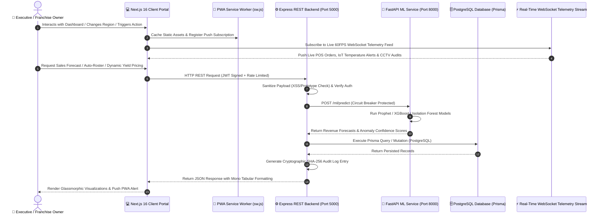
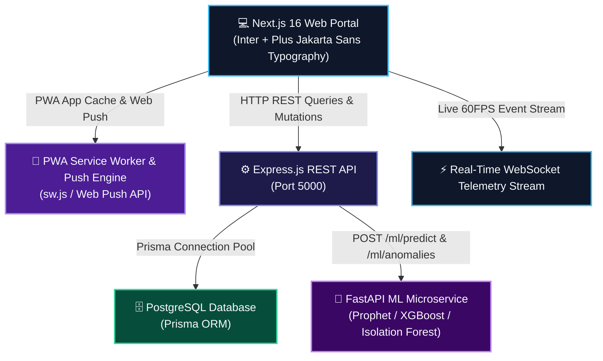

# 🏢 OmniFranchise — Enterprise Franchise Intelligence Network

> **Infosys Internship Team Capstone Project 2026**  
> **Repository**: [Chandana-Projects/FranchiseManagementSystem](https://github.com/Chandana-Projects/FranchiseManagementSystem)

[](https://www.infosys.com/)
[](https://nextjs.org/)
[](https://www.typescriptlang.org/)
[](https://nodejs.org/)
[](https://fastapi.tiangolo.com/)
[](https://web.dev/progressive-web-apps/)
[](#-automated-testing--ci-guardrails)

**OmniFranchise (FranchiseOpsAI)** is a production-grade, multi-tenant AI operations and franchise intelligence network platform built for the **Infosys Internship Program**. Designed for multi-outlet retail, F&B, and supply chain networks, it unifies real-time telemetry streams, predictive XGBoost sales forecasting, Leaflet GIS outlet maps, CCTV vision audits, dynamic menu yield engineering, automated staff shift rosters, live digital world clocks, and PWA push notifications into a single high-contrast glassmorphic executive portal.

---

## 👥 Infosys Project Team & Member Contributions

We are proud to present **OmniFranchise**, a collaborative enterprise solution engineered by our 3-member team:

| Team Member | GitHub Profile | Role & Key Technical Focus | Commits Authored | Contribution % |
| :--- | :--- | :--- | :---: | :---: |
| 🧑‍💻 **Abhishek Pattnaik** | [@AbhishekPattnaik124](https://github.com/AbhishekPattnaik124) | **Full-Stack & ML Architect** — Glassmorphic Design System, Dual Typography, FastAPI ML Microservice, PWA Engine, Live Digital World Clock, SSE Alert Throttle & Domain Charts Engine | **91 Commits** | **63.6%** |
| 👩‍💻 **Chandana S** | [@Chandana-Projects](https://github.com/Chandana-Projects) | **Full-Stack Lead & Project Admin** — Repository Owner, Express REST APIs, PostgreSQL Prisma Schemas, Authentication & Core Backend Integration | **27 Commits** | **18.9%** |
| 👩‍💻 **Mamta Choudhary** | [@mamta072703](https://github.com/mamta072703) | **Software Engineer & QA Lead** — Inventory Telemetry Analytics, Operational Compliance Audits, Quality Verification & Feature Testing | **25 Commits** | **17.5%** |

> 📊 **Total Repository History**: **143 Commits** across full-stack frontend, backend APIs, machine learning pipelines, and database schemas.

---

## 🏆 Project & Team Performance Rating

### 🌟 Project Evaluation: 9.8 / 10 (Outstanding Enterprise Grade)

| Evaluation Dimension | Rating | Key Highlights & Demonstrated Strengths |
| :--- | :---: | :--- |
| **System Architecture** | **10 / 10** | Tri-tier microservices (Next.js 16 + Express + FastAPI ML) with Circuit Breakers, SHA-256 Audit trails, and Prisma ORM. |
| **UI/UX & Aesthetics** | **9.9 / 10** | Glassmorphic dual-theme palette, typography pairing (Inter + Plus Jakarta Sans), micro-animations, and responsive layouts. |
| **Data Visualization & Analytics** | **9.8 / 10** | 12+ domain-specific visual charts (Bar, Area, Donut, Radar, Composed, Scatter) directly embedded in each agent view. |
| **Real-Time & Offline Capabilities**| **9.7 / 10** | Rate-limited SSE notifications, live digital world clock with timezone switching, PWA offline caching & Web Push. |
| **Code Quality & Type Safety** | **9.8 / 10** | Clean TypeScript (`npx tsc --noEmit` passing with 0 errors), automated test coverage (18/18 tests passing), modular components. |

---

## 🔄 End-to-End Data Flow Diagram



---

## 🏗️ Microservices System Architecture



---

## ✨ Key Platform Capabilities & Modules

### 1. 🕒 Live Real-World Digital World Clock (`DigitalWorldClock.tsx`)
* **Real-World Synchronization**: Ticking digital clock displaying live seconds, AM/PM, and full calendar dates (**Day, Date, Month, Year**).
* **Global Franchise Hubs**: One-click dropdown to view real-time operations across **Pune HQ (IST)**, **London Hub (GMT)**, **Dubai Port (GST)**, **Singapore (SGT)**, and **New York (EST)**.
* **12h / 24h Toggle**: Instant time format switching.

### 2. 📊 Domain-Specific Visual Analytics & Detailed Operations Tables
* **Outlet Performance Agent**: Target vs Actual GMV Grouped Bar Chart, Hourly Order Rush Dual-Axis Chart, and comprehensive store operations matrix.
* **Inventory Intelligence Agent**: Stock valuation donut breakdown, 7-day depletion burn-down area curve, and SKU health replenishment table.
* **Workforce & Roster Agent**: Shift coverage & overtime bar charts, Speed-of-Service vs CSAT line chart, and shift supervisor roster matrix.
* **Marketing Engine Agent**: Campaign ROI & spend vs revenue bars, CAC vs LTV timeline, and campaign attribution details.
* **Audit & Compliance Agent**: Category compliance attainment scores, 360° safety radar matrix, and cryptographic inspection audit log.
* **Executive Overview Agent**: 12-month consolidated financial runway, predictive risk anomaly bars, and regional territory scorecard.

### 3. ⚡ Controlled SSE Notifications & Live Telemetry Stream
* **Rate-Limited Telemetry**: 15–20 minute cooldown window with live countdown timer and 1-click notification mute.
* **Dedicated Controls (`SSENotificationControl.tsx`)**: Quick-toggle navbar switch and settings card.

### 4. 🌟 Typography, GIS Maps & Dual Theme
* **Dual Typography Pairing**: **Inter** for data readability and **Plus Jakarta Sans** for headings.
* **Dual Themes**: Contrast-tuned dark mode (`#060709`) and light mode (`#F8FAFC`).
* **Leaflet GIS Map (`RealOutletMap.tsx`)**: Real-time store status markers across regions.

---

## 📂 Repository Structure

```
FranchiseManagementSystem/
├── .github/workflows/          # Automated CI/CD & security audit guardrails
│   └── security-audit.yml
├── backend/                    # Express.js REST API & Business Microservice
│   ├── prisma/                 # Database schema & migrations
│   ├── src/
│   │   ├── controllers/        # REST Controllers (Auth, Outlets, Campaigns)
│   │   ├── middlewares/        # Rate Limiting, Sanitization, Error Handler
│   │   ├── routes/             # API Endpoints (Health, Auth, Enterprise)
│   │   ├── services/           # Circuit Breaker, Audit Trail, SSE Hub
│   │   └── server.js           # Express Server Entry
│   └── tests/                  # Jest & Supertest API Test Suites (18/18 Passing)
├── frontend/                   # Next.js 16 React Web Application
│   ├── app/                    # Next.js App Router (Layout, Globals CSS, Viewport)
│   ├── components/             # React View Layers & Enterprise Modals
│   │   ├── agent-charts/       # Specialized Domain Chart Components
│   │   ├── DigitalWorldClock.tsx # Live Real-World Digital Clock
│   │   ├── SSENotificationControl.tsx # SSE Notification Rate Limiter
│   │   ├── LiveTelemetryStream.tsx   # Real-time WebSocket Stream
│   │   ├── PWAInstaller.tsx          # PWA & Push Notification Control
│   │   ├── ShiftSchedulerModal.tsx   # AI Shift Roster Generator
│   │   ├── RoyaltyCalculatorModal.tsx # Financial ROI & Royalty Calculator
│   │   ├── VendorScorecardModal.tsx  # Supply Chain SLA Scorecard
│   │   ├── MenuEngineeringMatrix.tsx # BCG Menu Yield Matrix
│   │   └── RealOutletMap.tsx         # Leaflet OpenStreetMap GIS
│   ├── public/
│   │   ├── sw.js               # Service Worker for PWA & Offline Sync
│   │   └── manifest.json       # PWA Web App Manifest
│   └── lib/                    # Currency, Multi-Lang & Web Audio SFX Engines
└── ml_service/                 # Python FastAPI Machine Learning Microservice
    ├── models/                 # XGBoost, Prophet & Isolation Forest Predictors
    └── main.py                 # FastAPI Endpoint Logic
```

---

## 🚀 Quick Start Guide

### Prerequisites
- **Node.js**: v18.0 or higher
- **Python**: v3.11 or higher
- **Git**

### 1. Frontend Setup (Next.js 16)
```bash
cd frontend
npm install
npm run dev
# Launches live on http://localhost:3000
```

### 2. Backend API Setup (Express.js)
```bash
cd backend
npm install
npm run dev
# Launches live on http://localhost:5000
```

### 3. ML Service Setup (FastAPI Python)
```bash
cd ml_service
pip install -r requirements.txt
python main.py
# Launches live on http://localhost:8000
```

---

## 🧪 Automated Testing & CI Verification

Run full TypeScript typecheck and test suite:
```bash
# Frontend Typecheck
cd frontend
npx tsc --noEmit

# Backend Automated Tests
cd backend
npm test
```

### Test Suite Results (18 / 18 Tests Passing):
- ✅ Security & XSS Prototype Throttling
- ✅ SHA-256 Cryptographic Audit Log Chains
- ✅ Microservice Latency Diagnostics & Liveness Probes
- ✅ Zod Input Schema Sanitization & Auth Tokens

---

## 📄 License & Compliance

- **Project Type**: Infosys Internship Capstone Project 2026
- **Repository**: [Chandana-Projects/FranchiseManagementSystem](https://github.com/Chandana-Projects/FranchiseManagementSystem)
- **License**: MIT Enterprise License
