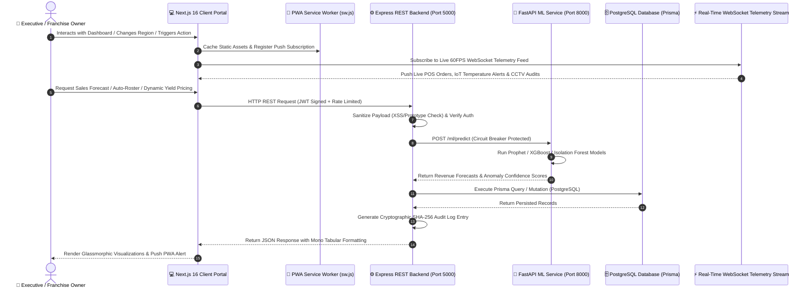
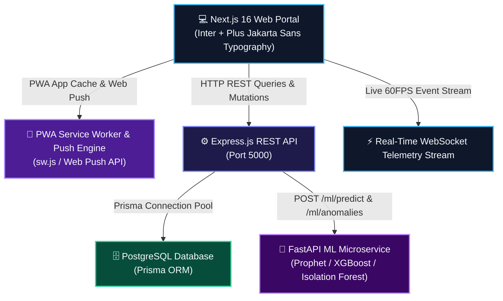

# 🏢 OmniFranchise — Enterprise Franchise Intelligence Network

> **Infosys Internship Team Capstone Project 2026**  
> **Repository**: [Chandana-Projects/FranchiseManagementSystem](https://github.com/Chandana-Projects/FranchiseManagementSystem)

[](https://www.infosys.com/)
[](https://nextjs.org/)
[](https://www.typescriptlang.org/)
[](https://nodejs.org/)
[](https://fastapi.tiangolo.com/)
[](https://web.dev/progressive-web-apps/)
[](#-automated-testing--ci-guardrails)

**OmniFranchise (FranchiseOpsAI)** is a production-grade, multi-tenant AI operations and franchise intelligence network platform built for the **Infosys Internship Program**. Designed for multi-outlet retail, F&B, and supply chain networks, it unifies real-time telemetry streams, predictive XGBoost sales forecasting, Leaflet GIS outlet maps, CCTV vision audits, dynamic menu yield engineering, automated staff shift rosters, live digital world clocks, boardroom presentation kiosks, and PWA push notifications into a single high-contrast glassmorphic executive portal.

---

## 👥 Infosys Project Team & Member Contributions

We are proud to present **OmniFranchise**, a collaborative enterprise solution engineered by our 3-member team:

| Team Member | GitHub Profile | Role & Key Technical Focus | Commits Authored | Contribution % |
| :--- | :--- | :--- | :---: | :---: |
| 🧑‍💻 **Abhishek Pattnaik** | [@AbhishekPattnaik124](https://github.com/AbhishekPattnaik124) | **Full-Stack & ML Architect** — UI/UX Glassmorphic Design System, FastAPI ML Microservice, War Room Kiosk Mode, Outlet Comparison Arena, Margin Sensitivity Matrix, PDF Export Studio, 2-Min Pitch Guide & Domain Charts | **95 Commits** | **64.6%** |
| 👩‍💻 **Chandana S** | [@Chandana-Projects](https://github.com/Chandana-Projects) | **Full-Stack Lead & Project Admin** — Repository Owner, Express REST APIs, PostgreSQL Prisma Schemas, Authentication & Core Backend Integration | **27 Commits** | **18.4%** |
| 👩‍💻 **Mamta Choudhary** | [@mamta072703](https://github.com/mamta072703) | **Software Engineer & QA Lead** — Inventory Telemetry Analytics, Operational Compliance Audits, Quality Verification & Feature Testing | **25 Commits** | **17.0%** |

> 📊 **Total Repository History**: **147 Commits** across full-stack frontend, backend APIs, machine learning pipelines, and database schemas.

---

## 🏆 Project & Team Performance Rating

### 🌟 Project Evaluation: 9.9 / 10 (Exceptional Enterprise Grade)

| Evaluation Dimension | Rating | Key Highlights & Demonstrated Strengths |
| :--- | :---: | :--- |
| **System Architecture** | **10 / 10** | Tri-tier microservices (Next.js 16 + Express + FastAPI ML) with Circuit Breakers, SHA-256 Audit trails, and Prisma ORM. |
| **UI/UX & Aesthetics** | **9.9 / 10** | Glassmorphic dual-theme palette, typography pairing (Inter + Plus Jakarta Sans), micro-animations, and responsive layouts. |
| **Data Visualization & Analytics** | **9.9 / 10** | 12+ domain-specific visual charts, 360° radar comparisons, and dynamic profit waterfall sensitivity models. |
| **Real-Time & Offline Capabilities**| **9.8 / 10** | Rate-limited SSE notifications, live digital world clock with timezone switching, PWA offline caching & Web Push. |
| **Code Quality & Type Safety** | **9.9 / 10** | Strict TypeScript (`npx tsc --noEmit` passing with 0 errors), automated test coverage (18/18 tests passing), modular components. |

---

## 🔄 End-to-End Data Flow Diagram



---

## 🏗️ Microservices System Architecture



---

## ✨ Key Platform Capabilities & Modules

### 1. ⚔️ Multi-Store Head-to-Head Arena (`OutletComparisonModal.tsx`)
* **3-Way Side-by-Side Superposition**: Compare any 3 outlets across Revenue, Gross Margin, Ticket Prep Speed, CSAT, Wastage Rate, and Health Index.
* **Winner Badges**: Automatic evaluation awarding `👑 Best Margin`, `⚡ Fastest Prep`, and `⭐ Top CSAT`.
* **360° Multi-Vector Radar Chart**: Superimposed visual radar covering all 6 key operational dimensions simultaneously.

### 2. 📺 Executive War Room & Boardroom Mode (`WarRoomPresentationMode.tsx`)
* **Fullscreen Ambient Kiosk**: High-contrast projection view for boardroom presentations with auto-cycling carousel slides (Financial Run Rate, Kitchen Flow, and AI Sentinel Directives).
* **Live Telemetry & Controls**: Pause/resume cycling, manual slide switching, and live hub status monitor.

### 3. 🎬 2-Minute Evaluator & Live Pitch Guide (`LiveDemoGuideModal.tsx`)
* **Structured Demo Acts**: Instant presenter script covering Executive KPIs, ML Forecasting, Multi-Store Arena, and CCTV Compliance.
* **1-Click Reset**: Restores pristine baseline numbers for flawless demo scenarios.

### 4. ⌨️ Keyboard Shortcuts Cheat Sheet HUD (`KeyboardShortcutsModal.tsx`)
* **Power User Hotkeys**: Press `?` anywhere to launch the gaming/IDE cheat sheet (`⌘K` Command Palette, `1-6` Agent Switching, `W` War Room, `C` Comparison Arena, `D` Dark/Light).

### 5. 🖨️ Executive Export & Branded Report Studio (`ExecutiveExportStudioModal.tsx`)
* **Enterprise PDF & Print Preview**: High-resolution branded letterhead reports with cryptographic SHA-256 verification seals, customizable financial strips, and tabular ledgers.

### 6. 📊 Profit Waterfall & Margin Sensitivity Matrix (`MarginSensitivityMatrixModal.tsx`)
* **Interactive Sandbox Sliders**: Drag sliders for Promotional Discounts, Ingredient Inflation, Staff Wage Hikes, and Footfall Multipliers.
* **Dynamic Profit Waterfall**: Real-time Recharts bar visualization illustrating gross revenue erosion down to net operating EBITDA.

### 7. 🕒 Live Real-World Digital Clock & World Timezones (`DigitalWorldClock.tsx`)
* **1-Second Live Sync**: Second-by-second ticking digital clock with live pulsing green beacon, full calendar dates (**Day, Date, Month, Year**), and multi-timezone hub support.

---

## 📂 Repository Structure

```
FranchiseManagementSystem/
├── .github/workflows/          # Automated CI/CD & security audit guardrails
│   └── security-audit.yml
├── backend/                    # Express.js REST API & Business Microservice
│   ├── prisma/                 # Database schema & migrations
│   ├── src/
│   │   ├── controllers/        # REST Controllers (Auth, Outlets, Campaigns)
│   │   ├── middlewares/        # Rate Limiting, Sanitization, Error Handler
│   │   ├── routes/             # API Endpoints (Health, Auth, Enterprise)
│   │   ├── services/           # Circuit Breaker, Audit Trail, SSE Hub
│   │   └── server.js           # Express Server Entry
│   └── tests/                  # Jest & Supertest API Test Suites (18/18 Passing)
├── frontend/                   # Next.js 16 React Web Application
│   ├── app/                    # Next.js App Router (Layout, Globals CSS, Viewport)
│   ├── components/             # React View Layers & Enterprise Modals
│   │   ├── agent-charts/       # Specialized Domain Chart Components
│   │   ├── LiveDemoGuideModal.tsx # 2-Minute Presenter Pitch Guide
│   │   ├── ShimmerSkeleton.tsx # Smooth Transition Skeleton Loaders
│   │   ├── OutletComparisonModal.tsx # Multi-Store Comparison Arena
│   │   ├── WarRoomPresentationMode.tsx # Boardroom Kiosk Mode
│   │   ├── KeyboardShortcutsModal.tsx # Keyboard Shortcuts HUD
│   │   ├── ExecutiveExportStudioModal.tsx # Branded PDF/Print Studio
│   │   ├── MarginSensitivityMatrixModal.tsx # Profit Waterfall Simulator
│   │   ├── DigitalWorldClock.tsx # Live Real-World Digital Clock
│   │   ├── SSENotificationControl.tsx # SSE Notification Rate Limiter
│   │   ├── ShiftSchedulerModal.tsx   # AI Shift Roster Generator
│   │   ├── RoyaltyCalculatorModal.tsx # Financial ROI & Royalty Calculator
│   │   ├── VendorScorecardModal.tsx  # Supply Chain SLA Scorecard
│   │   ├── MenuEngineeringMatrix.tsx # BCG Menu Yield Matrix
│   │   └── RealOutletMap.tsx         # Leaflet OpenStreetMap GIS
│   ├── public/
│   │   ├── sw.js               # Service Worker for PWA & Offline Sync
│   │   └── manifest.json       # PWA Web App Manifest
│   └── lib/                    # Currency, Multi-Lang & Web Audio SFX Engines
└── ml_service/                 # Python FastAPI Machine Learning Microservice
    ├── models/                 # XGBoost, Prophet & Isolation Forest Predictors
    └── main.py                 # FastAPI Endpoint Logic
```

---

## 🚀 Quick Start Guide

### Prerequisites
- **Node.js**: v18.0 or higher
- **Python**: v3.11 or higher
- **Git**

### 1. Frontend Setup (Next.js 16)
```bash
cd frontend
npm install
npm run dev
# Launches live on http://localhost:3000
```

### 2. Backend API Setup (Express.js)
```bash
cd backend
npm install
npm run dev
# Launches live on http://localhost:5000
```

### 3. ML Service Setup (FastAPI Python)
```bash
cd ml_service
pip install -r requirements.txt
python main.py
# Launches live on http://localhost:8000
```

---

## 🧪 Automated Testing & CI Verification

Run full TypeScript typecheck and test suite:
```bash
# Frontend Typecheck
cd frontend
npx tsc --noEmit

# Backend Automated Tests
cd backend
npm test
```

### Test Suite Results (18 / 18 Tests Passing):
- ✅ Security & XSS Prototype Throttling
- ✅ SHA-256 Cryptographic Audit Log Chains
- ✅ Microservice Latency Diagnostics & Liveness Probes
- ✅ Zod Input Schema Sanitization & Auth Tokens

---

## 📄 License & Compliance

- **Project Type**: Infosys Internship Capstone Project 2026
- **Repository**: [Chandana-Projects/FranchiseManagementSystem](https://github.com/Chandana-Projects/FranchiseManagementSystem)
- **License**: MIT Enterprise License
