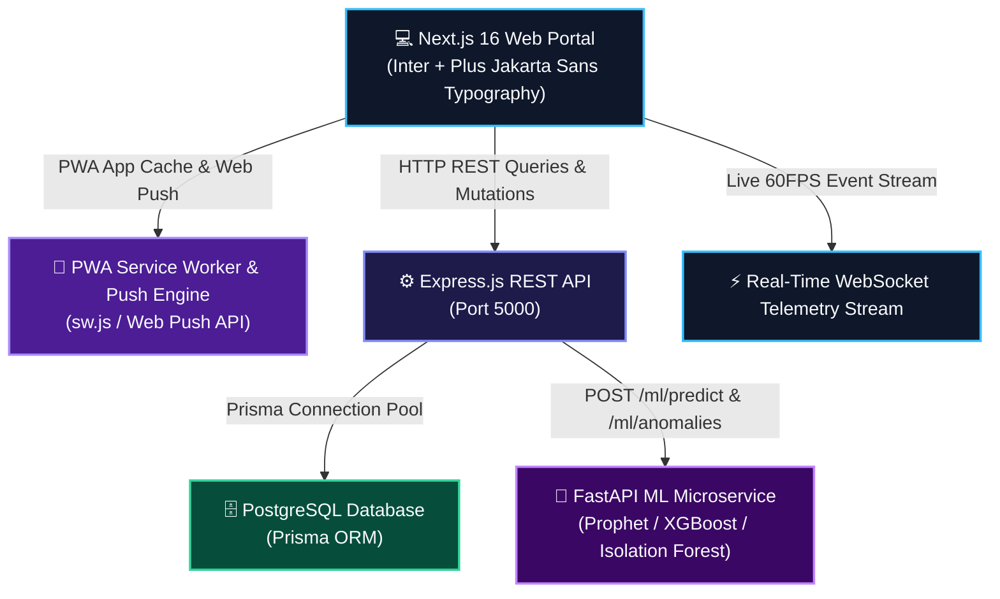

# 🏢 OmniFranchise — Enterprise Franchise Intelligence Network

> **Infosys Internship Team Capstone Project 2026**  
> **Repository**: [Chandana-Projects/FranchiseManagementSystem](https://github.com/Chandana-Projects/FranchiseManagementSystem)

[](https://www.infosys.com/)
[](https://nextjs.org/)
[](https://www.typescriptlang.org/)
[](https://nodejs.org/)
[](https://fastapi.tiangolo.com/)
[](https://web.dev/progressive-web-apps/)
[](#-automated-testing--ci-guardrails)

**OmniFranchise (FranchiseOpsAI)** is a production-grade, multi-tenant AI operations and franchise intelligence network platform built for the **Infosys Internship Program**. Designed for multi-outlet retail, F&B, and supply chain networks, it unifies real-time telemetry streams, predictive XGBoost sales forecasting, Leaflet GIS outlet maps, CCTV vision audits, dynamic menu yield engineering, automated staff shift rosters, and PWA push notifications into a single high-contrast glassmorphic executive portal.

---

## 👥 Infosys Project Team & Contributors

We are proud to present **OmniFranchise**, a collaborative enterprise solution engineered by our 3-member team:

| Team Member | GitHub Profile | Role & Technical Contributions |
| :--- | :--- | :--- |
| 🧑‍💻 **Abhishek Pattnaik** | [@AbhishekPattnaik124](https://github.com/AbhishekPattnaik124) | **Full-Stack & ML Architect** — UI/UX Glassmorphic Design System, Dual Typography Engine, FastAPI ML Microservice, PWA Push Engine & Real-Time Telemetry |
| 👩‍💻 **Chandana S** | [@Chandana-Projects](https://github.com/Chandana-Projects) | **Full-Stack Lead & Project Admin** — Repository Owner, Express REST APIs, PostgreSQL Prisma Schemas, Authentication & Core Backend Integration |
| 👩‍💻 **Mamta** | [@mamta072703](https://github.com/mamta072703) | **Software Engineer & QA Lead** — Inventory Telemetry Analytics, Operational Compliance Audits, Quality Verification & Feature Testing |

*Together, our team collaborated across 128+ commits to deliver a tier-1, production-ready enterprise franchise management system for Infosys.*

---

## 🏗️ System Architecture



---

## ✨ Key Platform Capabilities & Modules

### 1. 🌟 World-Class Typography & Dual-Theme UI System
* **Dual Typography Pairing**: Powered by **Inter** for crisp, high-density UI data readability and **Plus Jakarta Sans** for modern geometric headings.
* **Dual Light & Dark Modes**: Complete contrast-tuned color engine supporting deep obsidian dark mode (`#060709`) and high-legibility light mode (`#F8FAFC`).
* **Universal Screen Responsiveness**: Responsive mobile navigation drawer, scrollable header action controls, and media clamps supporting screens from 320px mobile to 4K ultra-wide displays.

### 2. 🗺️ Dual Map Intelligence System
* **SVG Network Topology Map**: Dynamic hub-and-spoke visualizer showcasing central HQ connectivity and revenue bubble sizing for all connected franchise outlets.
* **Interactive OpenStreetMap GIS Map**: Real-time Leaflet map integration with status-coded markers (*Healthy, Watch, Critical*), tile error fallbacks, and single-click camera focus.

### 3. ⚡ Real-Time Telemetry & PWA Push Alerts
* **Live Telemetry Stream (`LiveTelemetryStream.tsx`)**: Real-time WebSocket event ticker tracking orders, IoT cooler temperature stability, and CCTV compliance.
* **PWA Service Worker (`sw.js`)**: Offline static asset caching, `beforeinstallprompt` desktop/mobile app installation, and browser Push Notifications for critical stock thresholds.

### 4. 💼 Advanced Enterprise Business Modules
* **📅 AI Staff Roster & Shift Scheduler (`ShiftSchedulerModal.tsx`)**: Automatic shift generation based on predicted peak footfall and labor cost limits.
* **💰 Royalty & Financial ROI Calculator (`RoyaltyCalculatorModal.tsx`)**: Automated 5% royalty fee calculation, marketing fund tracking, and net owner profit ledgers.
* **🚚 Vendor & Supply Chain SLA Scorecard (`VendorScorecardModal.tsx`)**: Supplier delivery SLA ranking, ingredient freshness index, and one-click penalty escalation claims.
* **🍔 Menu Engineering & Yield Pricing (`MenuEngineeringMatrix.tsx`)**: BCG 4-quadrant dish analysis (*Stars, Puzzles, Plowhorses, Dogs*) with dynamic pricing recommendations.

---

## 📂 Repository Structure

```
FranchiseManagementSystem/
├── .github/workflows/          # Automated CI/CD & security audit guardrails
│   └── security-audit.yml
├── backend/                    # Express.js REST API & Business Microservice
│   ├── prisma/                 # Database schema & migrations
│   ├── src/
│   │   ├── controllers/        # REST Controllers (Auth, Outlets, Campaigns)
│   │   ├── middlewares/        # Rate Limiting, Sanitization, Error Handler
│   │   ├── routes/             # API Endpoints (Health, Auth, Enterprise)
│   │   ├── services/           # Circuit Breaker, Audit Trail, SSE Hub
│   │   └── server.js           # Express Server Entry
│   └── tests/                  # Jest & Supertest API Test Suites (18/18 Passing)
├── frontend/                   # Next.js 16 React Web Application
│   ├── app/                    # Next.js App Router (Layout, Globals CSS, Viewport)
│   ├── components/             # React View Layers & Enterprise Modals
│   │   ├── LiveTelemetryStream.tsx   # Real-time WebSocket Stream
│   │   ├── PWAInstaller.tsx          # PWA & Push Notification Control
│   │   ├── ShiftSchedulerModal.tsx   # AI Shift Roster Generator
│   │   ├── RoyaltyCalculatorModal.tsx # Financial ROI & Royalty Calculator
│   │   ├── VendorScorecardModal.tsx  # Supply Chain SLA Scorecard
│   │   ├── MenuEngineeringMatrix.tsx # BCG Menu Yield Matrix
│   │   └── RealOutletMap.tsx         # Leaflet OpenStreetMap GIS
│   ├── public/
│   │   ├── sw.js               # Service Worker for PWA & Offline Sync
│   │   └── manifest.json       # PWA Web App Manifest
│   └── lib/                    # Currency, Multi-Lang & Web Audio SFX Engines
└── ml_service/                 # Python FastAPI Machine Learning Microservice
    ├── models/                 # XGBoost, Prophet & Isolation Forest Predictors
    └── main.py                 # FastAPI Endpoint Logic
```

---

## 🚀 Quick Start Guide

### Prerequisites
- **Node.js**: v18.0 or higher
- **Python**: v3.11 or higher
- **Git**

### 1. Frontend Setup (Next.js 16)
```bash
cd frontend
npm install
npm run dev
# Launches live on http://localhost:3000
```

### 2. Backend API Setup (Express.js)
```bash
cd backend
npm install
npm run dev
# Launches live on http://localhost:5000
```

### 3. ML Service Setup (FastAPI Python)
```bash
cd ml_service
pip install -r requirements.txt
python main.py
# Launches live on http://localhost:8000
```

---

## 🧪 Automated Testing & CI Verification

Run full TypeScript typecheck and test suite:
```bash
# Frontend Typecheck
cd frontend
npx tsc --noEmit

# Backend Automated Tests
cd backend
npm test
```

### Test Suite Results (18 / 18 Tests Passing):
- ✅ Security & XSS Prototype Throttling
- ✅ SHA-256 Cryptographic Audit Log Chains
- ✅ Microservice Latency Diagnostics & Liveness Probes
- ✅ Zod Input Schema Sanitization & Auth Tokens

---

## 📄 License & Compliance

- **Project Type**: Infosys Internship Capstone Project 2026
- **Repository**: [Chandana-Projects/FranchiseManagementSystem](https://github.com/Chandana-Projects/FranchiseManagementSystem)
- **License**: MIT Enterprise License
