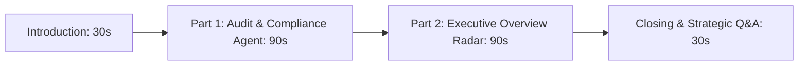

# 🎤 Executive Demo Presentation Script: Agent Dashboards

> **Scope**: Focused strictly on the **Audit & Compliance** and **Executive Overview** Agent Dashboards of **OmniFranchise AI**.  
> **Target Audience**: Executive Leadership / Franchise Board of Directors / Investors  
> **Total Duration**: ~3.5 Minutes  

---

## 📋 Executive Overview & Agenda

---

## 🎬 Section 1: Introduction & Transition (30s)

| Attribute | Details |
| :--- | :--- |
| **Screen Action** | Open `http://localhost:3000/agent-dashboards` and click tab **"5. Audit & Compliance"**. |
| **Visual Focus** | Show the unified Agent Dashboards interface with live telemetry ticker and top KPI badges. |

### 🎙️ Spoken Script:
> *"Good morning / afternoon everyone.*  
>
> *Today, I’m excited to walk you through how **OmniFranchise AI** replaces slow, retroactive manual reporting with real-time autonomous intelligence across our multi-outlet network.*  
>
> *Traditional franchise networks often suffer from fragmented operational data. In our platform, specialized multi-agent systems monitor store telemetry around the clock.*  
>
> *Let's inspect two core pillars of this intelligence suite:*
> 1. *Our **Audit & Compliance Intelligence Agent**, ensuring non-negotiable brand, hygiene, and financial standards.*
> 2. *Our consolidated **Executive Overview Radar**, synthesizing all network data for executive decision-makers."*

---

## 🛡️ Section 2: Part 1 — Audit & Compliance Dashboard (90s)

| Attribute | Details |
| :--- | :--- |
| **Screen Action** | 1. Hover over the **4 Top KPI Cards**. 2. Scroll down to the **Multi-Outlet SOP Compliance Heatmap Matrix**. 3. Highlight the **Cryptographic Verification Ledger** badge & **Decision Advisor**. |
| **Visual Focus** | KPIs (`94% SOP Compliance`, `7 Open Issues`, `96% Checklist Score`, `2.1 Days Avg Closure`), SOP Matrix (Nashik, Pune, Mumbai, Nagpur, Aurangabad, Solapur), and Action recommendations. |

### 🎙️ Spoken Script:
> *"Here on the **Audit & Compliance Dashboard**, we immediately see our network's operational baseline:*
>
> 1. **94% Network SOP Compliance** *across all operating franchise units.*
> 2. **Only 7 Open Issues** *currently flagged by our automated inspection monitors.*
> 3. **96% Digital Checklist Completion Score** *verified before morning peak rush hour.*
> 4. **An Average Resolution Time of 2.1 Days** *to remediate flagged operational issues.*
>
> *What sets OmniFranchise apart is this **Multi-Outlet SOP Compliance Heatmap**.*  
> *Rather than relying on vague composite averages, our agent audits 4 distinct operational categories:*
> - **Food Safety & Hygiene**: *Monitoring kitchen prep standards and cold-chain temperature thresholds.*
> - **Physical Safety Protocols**: *Fire exits, emergency equipment, and kitchen safety.*
> - **Cash & Register Audit**: *Detecting shift drawer discrepancies and unapproved discounts.*
> - **Branding Standards**: *Verified via Vision-AI photo inspection of storefront signage and uniforms.*
>
> *Notice how locations like **Nashik Hub (97%)** and **Pune FC Road (95%)** perform at gold-standard compliance. Meanwhile, the agent instantly isolates **Aurangabad Hub at 68%**, pinpointing cash register variances and safety checklist delays.*
>
> *Every audit log is stamped with a **Cryptographic Hash** on our audit ledger to guarantee zero tampering, while the **Decision Advisor** automatically prescribes a mandatory 48-hour regional manager re-inspection for at-risk stores."*

---

## 🧠 Section 3: Part 2 — Executive Overview Dashboard (90s)

| Attribute | Details |
| :--- | :--- |
| **Screen Action** | 1. Click on tab **"6. Executive Overview"**. 2. Point to the **Network Revenue Metrics** (`₹4.8 Cr Total Sales`, `+11% YoY Growth`, `91% Target Achievement`, `8 At-Risk Outlets`). 3. Highlight the **6-Axis Multi-Dimensional Radar Chart**. 4. Open the **What-If AI Sandbox** at top right. |
| **Visual Focus** | 6-Axis Radar Chart comparing live performance against target benchmarks, Strategic Synthesis Engine, and What-If interactive sliders. |

### 🎙️ Spoken Script:
> *"Now, let's step into the shoes of the CEO, COO, or Franchise Director in the **Executive Overview Dashboard**.*
>
> *This is the strategic synthesis layer where all operational agent streams—Sales, Inventory, Workforce, Marketing, and Audit—converge into a single command center.*
>
> *At a glance, leadership sees:*
> - **₹4.8 Crores in Total Network Revenue**, pacing at **+11% YoY Growth**.
> - **91% Target Achievement** *against network quarterly quotas.*
> - **8 Outlets currently categorized in the Watch or At-Risk tier**, *prioritized for intervention.*
>
> *The crown jewel of this dashboard is our **6-Axis Multi-Dimension Radar Chart**.*  
> *Rather than judging franchise health purely by top-line revenue, the radar benchmarks **Actual Performance** (in amber) against **Strategic Target Goals** (in sky blue) across 6 vital pillars:*
> - **Sales Growth (88/90)** and **Inventory Cover (84/80)** are tracking strongly.
> - **Audit SOPs (94/95)** and **Workforce Rostering (86/85)** reflect disciplined store management.
> - *Crucially, the radar immediately exposes our primary bottleneck: **Gross Margin (78% vs 85% Target)**.*
>
> *Our **Strategic Decision Engine** synthesizes these cross-agent findings, showing that aggressive promotional discounting is cannibalizing high-margin beverage sales.*
>
> *With our integrated **What-If AI Scenario Simulator**, executives can model changes to discount caps, staff coverage, or reorder frequencies before executing policy updates across the franchise network."*

---

## 🎯 Section 4: Closing & Strategic Wrap-up (30s)

### 🎙️ Spoken Script:
> *"In summary, OmniFranchise empowers leadership to manage hundreds of franchise outlets with algorithmic clarity—protecting brand reputation through automated audits, and driving unit profitability through executive AI intelligence.*
>
> *Thank you very much, and I would be glad to answer any questions."*

---

## 💡 Anticipated Executive Q&A Cheat Sheet

| Executive Question | Recommended Talking Point |
| :--- | :--- |
| **Q1: How are audit scores collected without adding manual burden?** | *"Scores are aggregated automatically through digital opening/closing checklists, IoT refrigeration temperature sensors, CCTV Vision-AI inspection scans, and POS shift reconciliation."* |
| **Q2: Can the 6-Axis Executive Radar adapt to different store formats?** | *"Yes. The radar's weightings and benchmarks automatically calibrate according to the franchise format (e.g., Flagship Metro Cafes vs. Highway Drive-Thrus vs. Cloud Kitchens)."* |
| **Q3: How does the What-If Sandbox calculate its projections?** | *"It uses multivariate predictive regression models trained on historical POS sales elasticity, footfall traffic patterns, and inventory lead times."* |
| **Q4: Is the system offline-resilient?** | *"Yes. The frontend features local dataset fallback resilience and synchronized state persistence, ensuring uninterrupted operations during connectivity drops."* |
